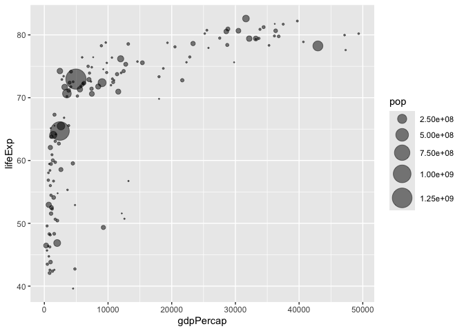

# Lab 5: Data Visualization with ggplot
Duy An Le (PID:A16400411)

- [Example 1: A basic scatter plot](#example-1-a-basic-scatter-plot)
- [Example 2: Getting more
  complicated](#example-2-getting-more-complicated)
- [Going Further: Optional Sections](#going-further-optional-sections)

Today we will have fun with the **ggplot2** package - a popular data
visualization package.

Other plotting systems in R include so-called *“base”*
plotting/graphics.

``` r
plot(cars)
```


Base plot is generally rather short code and somewhat dull plots - but
it is always there for you and is fast for big data sets.

## Example 1: A basic scatter plot

Using **ggplot2** takes some more work

``` r
## ggplot(cars)
```

Writing `ggplot(cars)` will not work. I need to install the package
first to my computer. To do this I can use the function
`install.packages("ggplot2")` in the console.

Then I will need to load the package I want to use with `library()`
call.

``` r
## install.packages("ggplot2")
library(ggplot2)
```

Now to make my plot and use ggplot:

- I first must initialize the data set in ggplot using `ggplot()`.
- Using the + operator I can then add layers to the plot with `aes()` to
  map the dimensions of the data set to the plot aesthetics.
- Finally, `geom_point()` will plot a dot plot.

``` r
ggplot(cars) + 
  aes(speed, dist) + 
  geom_point() 
```


To add more layers, you can save the plot to an object and use it in
later code chunks.

``` r
bp <- ggplot(cars) + 
  aes(speed, dist) + 
  geom_point() 

bp
```


``` r
bp + geom_smooth(method="lm", se=F) + 
  theme_bw() + 
  labs(title="Stopping Distance of Cars at Various Speeds", x = "Speed (MPH)",
       y="Distance (ft)")
```

    `geom_smooth()` using formula = 'y ~ x'


## Example 2: Getting more complicated

Now for a more realistic data set.

``` r
url <- "https://bioboot.github.io/bimm143_S20/class-material/up_down_expression.txt"
genes <- read.delim(url)
head(genes)
```

            Gene Condition1 Condition2      State
    1      A4GNT -3.6808610 -3.4401355 unchanging
    2       AAAS  4.5479580  4.3864126 unchanging
    3      AASDH  3.7190695  3.4787276 unchanging
    4       AATF  5.0784720  5.0151916 unchanging
    5       AATK  0.4711421  0.5598642 unchanging
    6 AB015752.4 -3.6808610 -3.5921390 unchanging

Some information about the dataset:

``` r
nrow(genes)
```

    [1] 5196

``` r
ncol(genes)
```

    [1] 4

``` r
table(genes$State)
```


          down unchanging         up 
            72       4997        127 

``` r
round(table(genes$State)/nrow(genes) * 100, 2)
```


          down unchanging         up 
          1.39      96.17       2.44 

Plotting the data set

``` r
p <- ggplot(genes) + 
  aes(x=Condition1, y=Condition2, col=State) + 
  geom_point()

p
```


Now to adjust the color palette manually use `scale_color_manual()`

``` r
p <- p + scale_color_manual(values=c("blue","gray", "red"))

p
```


Adjusting the plot labels:

``` r
p <- p + labs(title="Gene Expression Changes Upon Drug Treatment", 
              x="Control (no drug)", 
              y="Drug Treatment")
p
```


## Going Further: Optional Sections

Load in data set about economics and demographics about 142 countries
across many years. We focus on 2007 data only.

``` r
# File location online
url <- "https://raw.githubusercontent.com/jennybc/gapminder/master/inst/extdata/gapminder.tsv"

gapminder <- read.delim(url)

library(dplyr)
```


    Attaching package: 'dplyr'

    The following objects are masked from 'package:stats':

        filter, lag

    The following objects are masked from 'package:base':

        intersect, setdiff, setequal, union

``` r
gapminder_2007 <- gapminder %>% filter(year==2007)
```

Create scatter plot mapping GDP to the average life expectancy of the
countries.

``` r
ggplot(gapminder_2007) +
  aes(x=gdpPercap, y=lifeExp) +
  geom_point()
```


Adding more variables to aesthetics. We can distinguish the continents
of the countries and add a size variable to the dot sizes to indicate
population.

``` r
ggplot(gapminder_2007) +
  aes(x=gdpPercap, y=lifeExp, color=continent, size=pop) +
  geom_point(alpha=0.5)
```


``` r
ggplot(gapminder_2007) + 
  aes(x=gdpPercap, y=lifeExp, size=pop) + 
  geom_point(alpha=0.5) + 
  scale_size_area(max_size = 10)
```



``` r
gapminder_1957 <- gapminder %>% filter(year==1957)

ggplot(gapminder_1957) +
  aes(x=gdpPercap, y=lifeExp, size=pop, color=continent) + 
  geom_point(alpha=0.7) + 
  scale_size_area(max_size=10)
```


``` r
gapminder_1957_2007 <- gapminder %>% filter(year==1957 | year == 2007)

ggplot(gapminder_1957_2007) +
  aes(x=gdpPercap, y=lifeExp, size=pop, color=continent) + 
  geom_point(alpha=0.7) + 
  scale_size_area(max_size=10) + 
  facet_wrap(~year)
```


